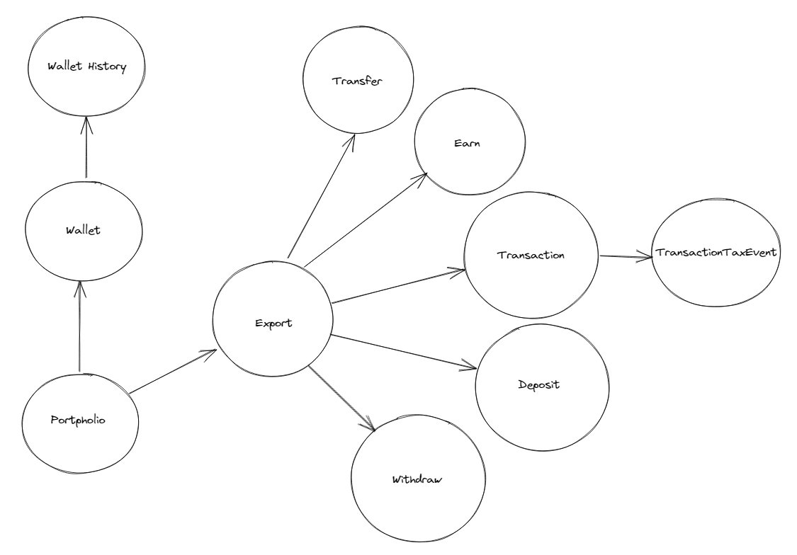

### Run docker containers

```
run DB via docker-compose.yml
```

### Adminer

```
http://localhost:8085/?pgsql=postgresql&username=crypto&db=cryptodatabase
Password: cryptoPassword
```

### Generate prisma releted files

```
npm run generate
npm run migrate
```

### Run server

```
npm run dev
```

### Database model


